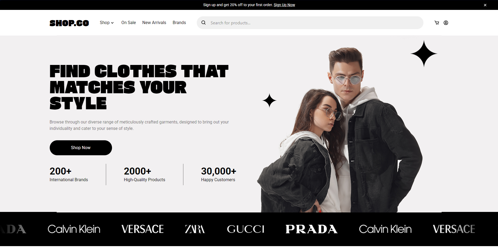
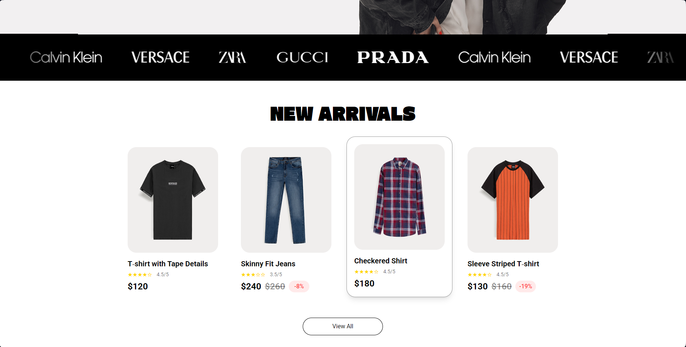
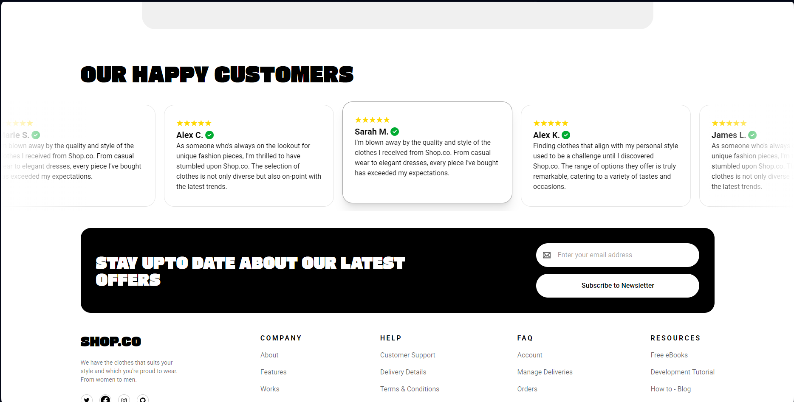

# Clothing E-commerce Website

This is a frontend project from a figma UI design file coded by AshDev using React+Vite and TailwindCSS. Credits to [hamzauix](https://www.figma.com/@hamzauix) for the UI design.

## Table of contents

- [Overview](#overview)
  - [Screenshot](#screenshot)
  - [Links](#links)
- [My process](#my-process)
  - [Built with](#built-with)
- [Author](#author)

## Overview

### Screenshot

### Links
- Live Site URL: [(https://clothing-ecommerce-ashdev.vercel.app)]

## Case Study

While browsing through hundreds of e-commerce UI designs on figma for my next front-end project, I came across this particular design that I think will represent the entirety of most e-commerce layout and designs out there, a simple template layout of a clothing e-commerce website. I decided to use React + Vite and TailwindCSS and added minimal yet satisfying hover interactions, I also added iconic scrolling banner using react-fast-marquee.

### Built with

- React + Vite
- TailwindCSS
- Flexbox
- Desktop-first workflow

## Author

- [Portfolio](https://trishacapitle.vercel.app)
- Github - [@trishacapitle](https://github.com/trishacapitle)
- LinkedIn - [@trisha-capitle](https://linkedin.com/in/trisha-capitle)

